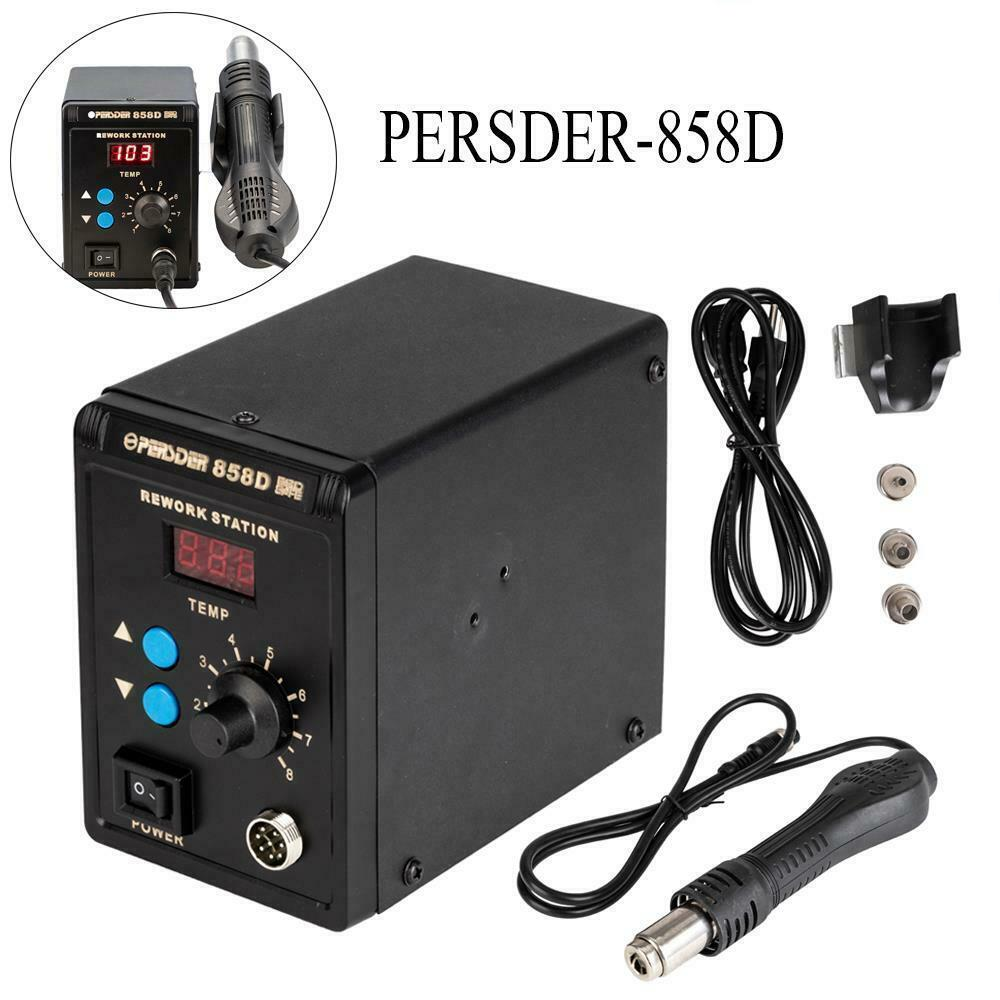

# Persder-858D SMD Hot Air Rework Station

This repository contains the reverse-engineered schematics of the Persder-858D Hot Air Rework Station
from an eBay supplier.
This hot air rework station is very similar to various other 858D-named (i.e.  - Atten 858D, Baku 8585D,
CO-Z 858D, Saike 858D, WEP 858D, etc.) hot air rework stations, except that the temperature setting
and fan speed controls are in the opposite order on the front panel and the temperature calibration 
potientiometer is not accessible via the front panel.
The microcontroller (MCU) used in the Persder-858D has no markings but is a 20-pin DIP device
(in a socket) that appears to be connected the same as the MK1841D3 MCU used in the Baku 8585D.

* [Reverse-engineered schematics](Persder-858D_Schematic.pdf)
* [Parts List](Parts.txt)

